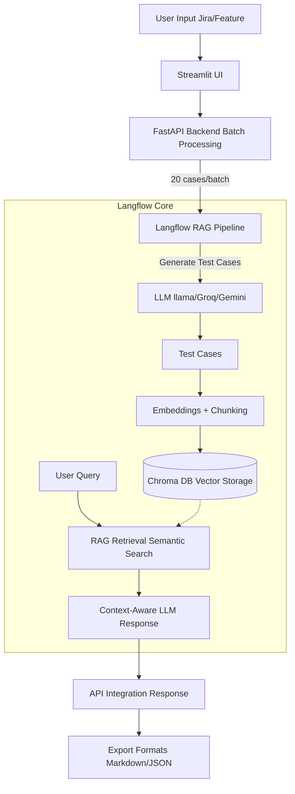

# Test Case Generator using RAG, Langflow & Batch Processing with UI


An enterprise-grade AI Test Case Generator that leverages RAG (Retrieval-Augmented Generation), Langflow pipelines, and LLMs (Groq / Llama3) to generate **500+ scalable, high-quality test cases** from JIRA or feature inputs.

The system uses batch processing to overcome LLM token limits and integrates a Streamlit UI with a FastAPI backend for seamless user interaction.

## 💡 Why This Project?
LLMs cannot generate large volumes of structured output (e.g., 500+ test cases) in a single request due to token limitations.

This project solves that problem using:
- Batch processing
- RAG architecture
- Prompt engineering
- Deduplication strategies

This ensures scalability, accuracy, and high-quality output.

## 🚀 Features
- **✅ 500+ Test Case Generation:** Successfully generates 500+ unique, structured test cases in a single run
- **✅ Batch-based Generation:** Generates large volumes using controlled batching (20 per batch)
- **✅ Perfect Sequential Numbering:** Ensures TC-001 → TC-500+ without gaps
- **✅ Dynamic Makeup Engine:** Automatically fills missing test cases if a batch under-produces
- **✅ Rate Limit Handling:** Detects API limits (429) and retries intelligently with exponential backoff
- **✅ Auto-Save System:** Saves outputs in Markdown and JSON formats with metadata
- **✅ Multi-layer Deduplication:** Prevents duplicate scenarios using contextual memory
- **✅ Circuit Breakers:** Stops execution safely during repeated failures
- **✅ Role-Based Test Coverage:** Generates tests across positive, negative, boundary, security, performance, and more

## 📸 Screenshots

### UI - Test Case Generation Screen


### UI - Generation In Progress


### UI - 500+ Test Cases Successfully Generated


### UI - Download & Export Options


### Langflow RAG Pipeline


## 🏗️ Architecture Diagram



## 🧩 Workflow

1. User Input  
   → JIRA ticket or feature description via UI  

2. Batch Processing  
   → Splits generation into batches (20 test cases each)  

3. LLM Generation  
   → Langflow orchestrates prompt-based test case creation  

4. RAG Storage  
   → Test cases converted to embeddings and stored in Chroma DB  

5. Retrieval  
   → Relevant test cases fetched using semantic search  

6. Response Generation  
   → LLM generates context-aware output  

7. Export  
   → Outputs saved as Markdown / JSON with full metadata  

## 🛠️ Tech Stack
- **Frontend:** Streamlit 
- **Backend:** FastAPI, Uvicorn, Python `requests`
- **AI Processing:** Langflow, Groq API (Llama3)
- **Storage:** ChromaDB (vector), local file system (Markdown/JSON)

## 📦 Installation & Usage

1. **Clone the repo**
   ```bash
   git clone https://github.com/Naveen-Ravichandran003/ai-testcase-generator-with-rag-ui.git
   cd ai-testcase-generator-with-rag-ui
   ```

2. **Install dependencies**
   ```bash
   pip install -r requirements.txt
   ```

3. **Start the FastAPI Backend**
   ```bash
   uvicorn main:app --reload --port 8000
   ```

4. **Start the Streamlit UI**
   ```bash
   streamlit run app.py --server.port 8501
   ```

5. **Start Generating**
   - Access the UI at `http://localhost:8501`.
   - Enter your Jira User Story and your Langflow Flow ID.
   - Set your target count (tested and verified up to **525+ test cases** in a single run).
   - Let the dynamic self-healing pipeline do the heavy lifting!

## 💾 Saved Exports
All runs are securely cached in the `saved_test_cases/` directory and exported in both `.md` (Markdown) and `.json` formats with full metadata tracking (timestamps, batch counts, total generated). Files can be used for Jira imports, review, or further analysis.

---
**Developed by Naveen Ravichandran**
